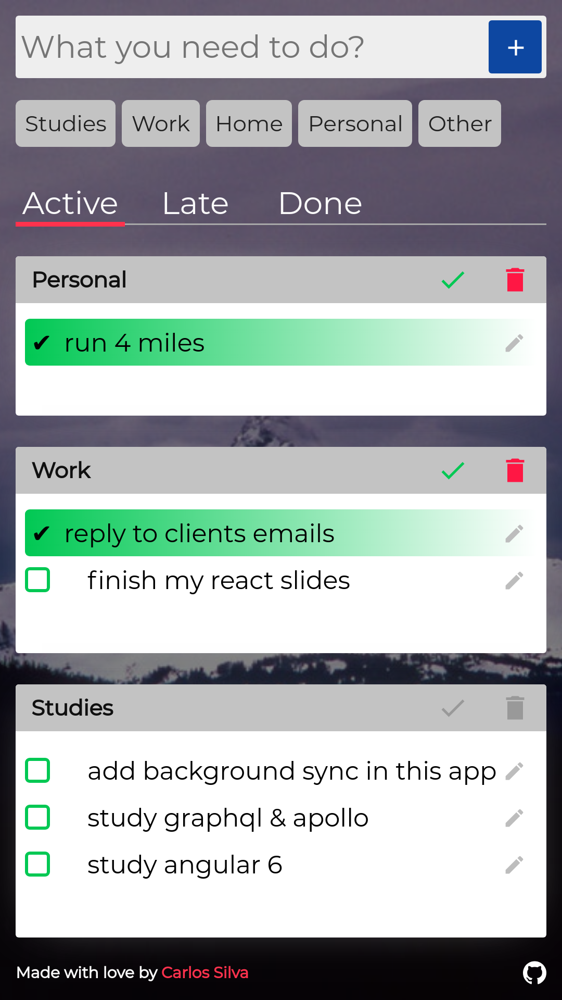
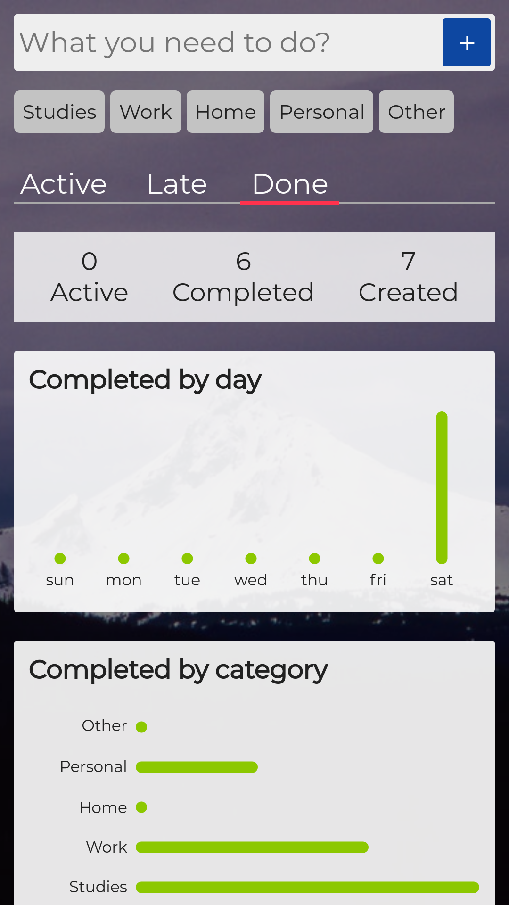

# yet another todo list

App created with React/Redux and Styled-Components, also uses IndexedDB to persist user created content.

Demo: [here](https://carlosqsilva.github.io/yatl/)

## Todo

- [ ] Add Background sync.
- [ ] Improve transition and animations.
- [ ] Write tests.

# License

[MIT License](./LICENSE) © [Carlos Silva](carloseng.com)
